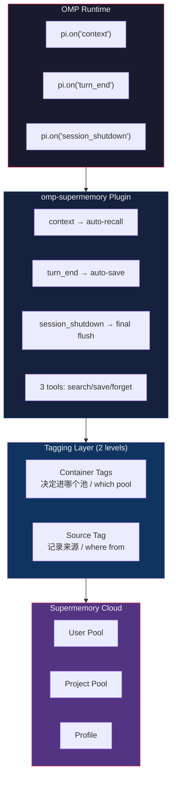

# omp-supermemory v2.0.0

> Persistent AI memory for OMP — auto-recall, auto-save, multi-machine shared pools.
> OMP 持久化记忆插件 — 自动召回、自动存档、多机共池。
> 
> [Supermemory](https://supermemory.ai) · [GitHub](https://github.com/Loveacup/omp-supermemory) · MIT

---

# 🤖 AI-READABLE SECTION (AI 可读)

> **Token-efficient reference.** Read this section to understand and operate the plugin. Human-oriented docs follow below.

## What this plugin does

An OMP extension that gives the agent persistent memory across sessions, machines, and projects. It hooks into OMP's lifecycle to auto-recall relevant memories before every LLM turn and auto-save conversation context periodically.

## Install

```bash
cd omp-supermemory
npm install
omp plugin link .
```

The extension auto-loads via `package.json` → `omp.extensions: ["./src/index.js"]`.

## Auth

```bash
node src/login.js          # browser OAuth → ~/.omp/supermemory/credentials.json
```
Or: `set SUPERMEMORY_API_KEY=sm_...`

## Config file: `~/.omp/supermemory.json`

| Key | Type | Default | Purpose |
|---|---|---|---|
| `autoRecallEveryPrompt` | `boolean` | `true` | Inject relevant memories before each LLM turn |
| `captureEveryNTurns` | `number` | `3` | Auto-save transcript every N turn pairs |
| `maxMemories` | `number` | `5` | Max user memories injected per recall |
| `maxProjectMemories` | `number` | `10` | Max project memories injected per recall |
| `maxProfileItems` | `number` | `5` | Max profile items per recall |
| `injectProfile` | `boolean` | `true` | Include profile in recall |
| `similarityThreshold` | `number` | `0.6` | Min similarity for search |
| `recallDedupMs` | `number` | `30000` | Suppress duplicate queries within window |
| `recallBudgetMs` | `number` | `8000` | Search timeout per call (ms) |
| `containerTagPrefix` | `string` | `"omp"` | Tag prefix for all containers |
| `projectContainerTag` | `string` | `null` | Pin project container (overrides hash) |
| `userContainerTag` | `string` | `null` | Pin user container (overrides hash) |

## Key precedence

```
SUPERMEMORY_API_KEY env > supermemory.json apiKey > credentials.json apiKey
```

> Prefer env var or credentials.json for the API key.

## Tools provided

| Tool | Description |
|---|---|
| `supermemory_search` | `query` (required), `scope: "user"\|"project"\|"both"`, `includeProfile: bool` |
| `supermemory_save` | `content` (required), `scope: "user"\|"project"`, `type: string` |
| `supermemory_forget` | `description` (required) — searches both pools and deletes all matches |

## Architecture invariants

1. **Fail-open** — all handlers wrapped in try/catch. Never blocks conversation.
2. **Test injection** — `internals.js#setClient()` enables mock client without real SDK calls.
3. **Dedup** — identical queries within `recallDedupMs` ms are suppressed.
4. **Source tag** — auto-detected `omp-windows` / `codex-macbook` sent as `x-sm-source` header.
5. **Recall format** — injected as system message: `## Relevant memory (Supermemory)` followed by bullet list.

## Container / tagging scheme

Two independent layers:

**Container Tags** (determine which pool a memory goes into):
```
User tag:    {prefix}_user_{sha16(git-email || os-username)}
Project tag: {prefix}_project_{sha16(absolute-cwd)}
```
- User pool auto-shares across machines when git email matches.
- Project pool does NOT auto-share (paths differ → hashes differ). Pin `projectContainerTag` for cross-machine project sharing.

**Source Tag** (records which machine/CLI wrote the memory — metadata only, does not affect pool routing):
```
{omp|codex}-{windows|macbook|linux}
```

## Env vars

| Variable | Purpose |
|---|---|
| `SUPERMEMORY_API_KEY` | API key (highest priority) |
| `SUPERMEMORY_AUTH_URL` | OAuth redirect base |
| `SUPERMEMORY_AUTH_TIMEOUT` | OAuth callback timeout (ms) |
| `SUPERMEMORY_RECALL_NO_GATE` | `1` to disable recall storm guard |
| `SUPERMEMORY_RECALL_GATE_MS` | Storm guard window (default 12000) |
| `SUPERMEMORY_SOURCE` | Override source tag |
| `SUPERMEMORY_CONFIG_PATH` | Override config path (tests) |
| `SUPERMEMORY_CREDS_PATH` | Override creds path (tests) |

## Test

```bash
npm test                    # 46 tests, all passing
node --test tests/index.test.js
```

---

# 👤 HUMAN-READABLE SECTION (人可读)

## 这是什么？ / What is this?

**omp-supermemory** 是 OMP (Oh My Pi) 的持久化记忆插件。它让 AI Agent 拥有跨会话、跨机器、跨项目的长期记忆——不用你每次重启 OMP 都重新交代背景。

**omp-supermemory** is a persistent memory plugin for OMP. It gives your AI agent long-term memory that survives session restarts, machine switches, and project changes.

### 它解决什么问题？ / What problem does it solve?

每次开新会话 Agent 不认识你？在不同电脑上记忆不互通？团队项目知识孤岛？

Every new session, the agent forgets everything. Switching machines? Different pools. Team projects? Knowledge silos.

- **Auto-recall** — relevant memories injected before each LLM turn
- **Auto-save** — transcript auto-captured every N turns, no manual effort
- **User pool** — auto-shares when `git config user.email` matches across machines
- **Project pool** — share via `projectContainerTag` pin (paths differ → hashes differ, so cross-machine sharing requires explicit config)

## 架构 / Architecture



## 标签系统：两层结构 / Tagging: two distinct layers

标签系统分两层，各司其职：

### 1. 容器标签 (Container Tags) — 决定记忆进哪个池

```
User Tag:   {prefix}_user_{sha16(git-email || os-username)}
Project Tag: {prefix}_project_{sha16(absolute-cwd)}
```

**User pool** 跨机自动共享（同一 git email），**project pool** 默认不跨机（不同机器路径不同 → hash 不同）。要跨机共享项目池，显式 pin `projectContainerTag`。

### 2. 来源标签 (Source Tag) — 记录记忆由谁写入

```
Source Tag:  "{omp|codex}-{windows|macbook|linux}"
→ 作为 x-sm-source header，每个 API 调用都带上
```

来源标签**不影响池归属**，仅作为元数据标记。可覆盖：`SUPERMEMORY_SOURCE=my-label`。

### 多机多 CLI 共池示意 / Multi-machine shared pools

```
┌──────────────────────────────────────────────────────────┐
│                  Supermemory Cloud                        │
│                                                           │
│  ┌──────────────────────┐   ┌─────────────────────────┐  │
│  │  User Pool           │   │  Project Pool           │  │
│  │  omp_user_a1b2c3d4   │   │  omp_project_f9e8d7c6  │  │
│  │  (same git email →   │   │  (pinned via config)    │  │
│  │   auto-shared ✓)     │   │                         │  │
│  └──────────────────────┘   └─────────────────────────┘  │
│            ▲                            ▲                 │
└────────────┼────────────────────────────┼─────────────────┘
             │                            │
  ┌──────────┴──────────┐    ┌───────────┴───────────┐
  │  Desktop (Win11)    │    │  Laptop (macOS)       │
  │  OMP CLI            │    │  Codex                │
  │  git: alex@corp.com │    │  git: alex@corp.com   │
  │  cwd: C:\project    │    │  cwd: /Users/alex/    │
  │                     │    │        project         │
  │  User tag: a1b2c3d4 │    │  User tag: a1b2c3d4   │
  │  Proj tag: ab12cd34 │    │  Proj tag: ef56gh78   │
  │  Source: omp-windows │    │  Source: codex-macbook│
  └─────────────────────┘    └────────────────────────┘
```

| 场景 / Scenario | 结果 / Result |
|---|---|
| 同一人，两台机器，同一 git email | ✅ User pool 自动共享 |
| 同一人，两台机器，同一项目 | ⚠️ Project pool 不共享（路径不同）；需 pin `projectContainerTag` |
| 同一人在不同项目 | ✅ User pool 共享，Project pool 隔离 |
| 不同人在同一项目 | ⚠️ User pool 隔离；Project pool 共享需 pin tag |
| OMP + Codex 同时使用 | ✅ 同一套标签规则，池互通；source tag 区分来源 |

### 覆盖配置 / Overrides

- `userContainerTag: "team-alex"` → 团队共享用户池
- `projectContainerTag: "project-x"` → **跨机器/跨仓库共享项目池**
- `containerTagPrefix: "myorg"` → 全局标签前缀
- `SUPERMEMORY_SOURCE=my-label` → 自定义来源标签

## 安装 / Install

```bash
# 1. Clone
git clone https://github.com/Loveacup/omp-supermemory.git
cd omp-supermemory

# 2. Install dependencies
npm install

# 3. Link as OMP plugin
omp plugin link .

# 4. Verify
omp plugin list
```

## 登录 / Login

```bash
node src/login.js
```

浏览器会打开 Supermemory 控制台，授权后 API key 自动保存到 `~/.omp/supermemory/credentials.json`。

或者手动设置：

```bash
# Windows
set SUPERMEMORY_API_KEY=sm_...

# macOS / Linux
export SUPERMEMORY_API_KEY=sm_...
```

获取 key: [console.supermemory.ai/keys](https://console.supermemory.ai/keys)

## 配置 / Configuration

编辑 `~/.omp/supermemory.json`：

```json
{
  "autoRecallEveryPrompt": true,
  "captureEveryNTurns": 3,
  "maxProjectMemories": 10,
  "maxMemories": 5,
  "containerTagPrefix": "omp",
  "projectContainerTag": null,
  "userContainerTag": null
}
```

完整配置项见上方 AI-READABLE 区域。

> **安全提示 / Security:** 推荐用 `SUPERMEMORY_API_KEY` 环境变量或 `credentials.json` 存储 API key。`supermemory.json` 中的 `apiKey` 字段仅为兼容保留，不推荐使用——该文件可能被复制或分享。

## 验证 / Verification

安装完成后，验证三步：

```bash
# 1. 插件是否加载
omp plugin list | grep supermemory

# 2. 登录是否成功
node -e "require('./src/config.js').CONFIG.isConfigured()"

# 3. 跑测试
npm test
```

Auto-recall 已在 2026-06-29 通过跨会话干净验证（全新 session 第一条消息成功召回标记记忆）。Auto-save 运行时行为已通过单元测试覆盖，端到端验证待完成。

## 文件结构 / File structure

```
omp-supermemory/
├── src/
│   ├── index.js         # Extension factory (hooks + tools)
│   ├── config.js        # Frozen CONFIG, key resolution
│   ├── tags.js          # User/project/source tag derivation
│   ├── client.js        # SupermemoryClient (search/add/delete/profile)
│   ├── internals.js     # getClient/setClient (test injection point)
│   └── login.js         # Standalone OAuth browser login
├── skills/              # OMP skill definitions
│   ├── supermemory-search/SKILL.md
│   ├── supermemory-save/SKILL.md
│   ├── supermemory-forget/SKILL.md
│   └── supermemory-login/SKILL.md
├── tests/               # 46 tests, all passing
├── package.json
└── README.md
```

## 设计决策 / Design decisions

| 决策 | 原因 |
|---|---|
| **Fail-open** | 记忆功能是增值，不是阻断点。任何异常都不影响对话。 |
| **单扩展** | 从双系统 (Codex hooks + OMP hooks) 合并为单一 factory。 |
| **Test injection** | `internals.js` 的 `setClient()` 让测试注入 mock client，不碰真实 SDK。 |
| **SHA16 哈希标签** | 基于 git email + cwd 派生，天然支持多机同池，无需手动配置。 |
| **30s dedup** | 短时间内重复查询去重，避免 worker 风暴。 |
| **Source tag** | 每个 API 调用带 `x-sm-source`，可追踪记忆来源（哪台机器、哪个 CLI）。 |

## 已知限制 / Known limitations

1. `supermemory_forget` 无 scope 参数——同时删除 project + user 池匹配项，可能过于激进。
2. 部分测试依赖 `process.cwd()`，需在项目根目录运行。
3. 修改 `src/index.js` 后需重启 OMP 才能生效（模块在 session 启动时加载）。

## License

MIT
