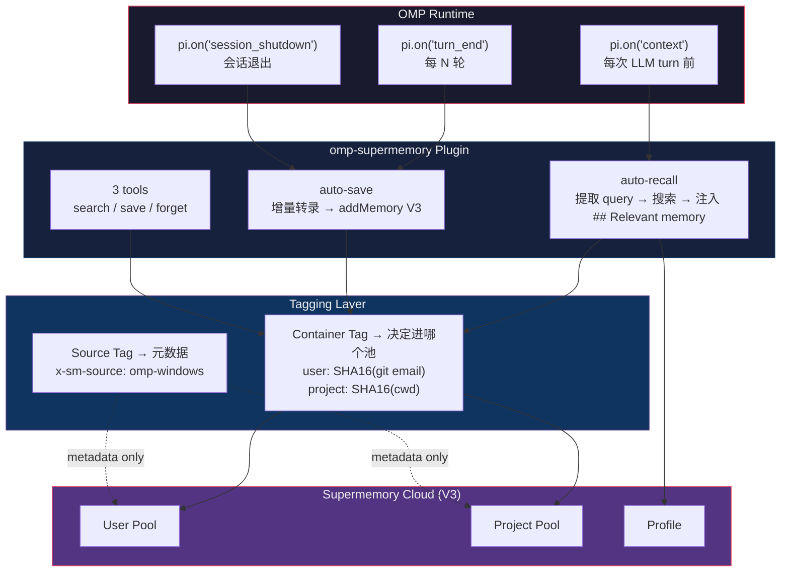

# omp-supermemory v2.0.1

> Persistent AI memory for OMP — auto-recall, auto-save, multi-machine shared pools.
> OMP 持久化记忆插件 — 自动召回、自动存档、多机共池。
> 
> [Supermemory](https://supermemory.ai) · [GitHub](https://github.com/Loveacup/omp-supermemory) · MIT

---

# 🤖 AI-READABLE SECTION (AI 可读)

> **Token-efficient reference.** Read this section to understand and operate the plugin. Human-oriented docs follow below.

## What this plugin does

An OMP extension that gives the agent persistent memory across sessions, machines, and projects. It hooks into OMP's lifecycle to auto-recall relevant memories before every LLM turn and auto-save conversation context periodically.

## Install

```bash
cd omp-supermemory
npm install
omp plugin link .
```

The extension auto-loads via `package.json` → `omp.extensions: ["./src/index.js"]`.

## Auth

```bash
node src/login.js          # browser OAuth → ~/.omp/supermemory/credentials.json
```
Or: `set SUPERMEMORY_API_KEY=sm_...`

## Config file: `~/.omp/supermemory.json`

| Key | Type | Default | Purpose |
|---|---|---|---|
| `autoRecallEveryPrompt` | `boolean` | `true` | Inject relevant memories before each LLM turn |
| `captureEveryNTurns` | `number` | `3` | Auto-save transcript every N turn pairs |
| `maxMemories` | `number` | `5` | Max user memories injected per recall |
| `maxProjectMemories` | `number` | `10` | Max project memories injected per recall |
| `maxProfileItems` | `number` | `5` | Max profile items per recall |
| `injectProfile` | `boolean` | `true` | Include profile in recall |
| `similarityThreshold` | `number` | `0.6` | Min similarity for search |
| `recallDedupMs` | `number` | `30000` | Suppress duplicate queries within window |
| `recallBudgetMs` | `number` | `8000` | Search timeout per call (ms) |
| `containerTagPrefix` | `string` | `"omp"` | Tag prefix for all containers |
| `projectContainerTag` | `string` | `null` | Pin project container (overrides hash) |
| `userContainerTag` | `string` | `null` | Pin user container (overrides hash) |

## Key precedence

```
SUPERMEMORY_API_KEY env > supermemory.json apiKey > credentials.json apiKey
```

> Prefer env var or credentials.json for the API key.

## Tools provided

| Tool | Description |
|---|---|
| `supermemory_search` | `query` (required), `scope: "user"\|"project"\|"both"`, `includeProfile: bool` |
| `supermemory_save` | `content` (required), `scope: "user"\|"project"`, `type: string` |
| `supermemory_forget` | `description` (required), `scope: "user"\|"project"\|"both"` (default `"both"`) — searches and deletes matches in the specified pool(s) |

## Architecture invariants

1. **Fail-open** — all handlers wrapped in try/catch. Never blocks conversation.
2. **Test injection** — `internals.js#setClient()` enables mock client without real SDK calls.
3. **Dedup** — identical queries within `recallDedupMs` ms are suppressed.
4. **Source tag** — auto-detected `omp-windows` / `codex-macbook` sent as `x-sm-source` header.
5. **Recall format** — injected as system message: `## Relevant memory (Supermemory)` followed by bullet list.
6. **Shutdown deadline** — `session_shutdown` handler races `captureNew` against a 1.8s deadline; host 2s hard-kill is safely absorbed without blocking shutdown.

## Container / tagging scheme

Two independent layers; only container tags affect pool routing.

**Container Tags** (determine which pool a memory goes into):
```
User tag:    {prefix}_user_{SHA16(git-email || os-username)}
Project tag: {prefix}_project_{SHA16(cwd-path)}
```
- User pool auto-shares across machines when `git config user.email` matches — same person, all devices, all CLIs share one user pool.
- Project pool does NOT auto-share because `cwd` differs per machine. To share a project pool across machines, pin `projectContainerTag` in config.
- Pin `userContainerTag` to create a shared user pool across different git emails (e.g. team pool).

**Source Tag** (metadata only — records which machine/CLI wrote the memory; does NOT affect pool routing):
```
{omp|codex}-{windows|macbook|linux}
```
Sent as `x-sm-source` header on every API call.

**Quick reference — pool sharing scenarios:**

| Scenario | User Pool | Project Pool |
|---|---|---|
| Same person, two machines, same git email | ✅ Auto-shared | — |
| Same person, two machines, same project | ✅ Auto-shared | ⚠️ Pin `projectContainerTag` |
| Same person, different projects | ✅ Auto-shared | ❌ Isolated (different cwd → different hash) |
| Different people, same project | ❌ Isolated (different git email) | ⚠️ Pin `projectContainerTag`（cwd 通常不同；同机同路径则自动同池） |
| OMP + Codex on same machine | ✅ Same tag rules, pools interoperable | ✅ Same tag rules, pools interoperable |

## Env vars

| Variable | Purpose |
|---|---|
| `SUPERMEMORY_API_KEY` | API key (highest priority) |
| `SUPERMEMORY_AUTH_URL` | OAuth redirect base |
| `SUPERMEMORY_AUTH_TIMEOUT` | OAuth callback timeout (ms) |
| `SUPERMEMORY_RECALL_NO_GATE` | `1` to disable recall storm guard |
| `SUPERMEMORY_RECALL_GATE_MS` | Storm guard window (default 12000) |
| `SUPERMEMORY_SOURCE` | Override source tag |
| `SUPERMEMORY_CONFIG_PATH` | Override config path (tests) |
| `SUPERMEMORY_CREDS_PATH` | Override creds path (tests) |

## Test

```bash
npm test                    # 51 tests, all passing
node --test tests/index.test.js
```

---

# 👤 HUMAN-READABLE SECTION (人可读)

## 这是什么？ / What is this?

**omp-supermemory** 是 OMP (Oh My Pi) 的持久化记忆插件。它让 AI Agent 拥有跨会话、跨机器、跨项目的长期记忆——不用你每次重启 OMP 都重新交代背景。

**omp-supermemory** is a persistent memory plugin for OMP. It gives your AI agent long-term memory that survives session restarts, machine switches, and project changes.

### 它解决什么问题？ / What problem does it solve?

每次开新会话 Agent 不认识你？在不同电脑上记忆不互通？团队项目知识孤岛？

Every new session, the agent forgets everything. Switching machines? Different pools. Team projects? Knowledge silos.

- **Auto-recall** — relevant memories injected before each LLM turn
- **Auto-save** — transcript auto-captured every N turns, no manual effort
- **User pool** — auto-shares when `git config user.email` matches across machines
- **Project pool** — share via `projectContainerTag` pin (paths differ → hashes differ, so cross-machine sharing requires explicit config)

## 架构 / Architecture

### 单机数据流 / Single-machine data flow




### 多机多 CLI 全景 / Full multi-machine view

Hermes（运行在 Mac mini）通过 remote 调用三台机器上的 OMP / Codex / Claude Code agent。所有 CLI 共用同一套 User/Project Pool，靠 source tag 区分来源：

```
                         Hermes (Mac mini)
                         remote 调用各机器 agent
                              │
         ┌────────────────────┼────────────────────┐
         ▼                    ▼                    ▼
   ┌──────────┐        ┌──────────┐        ┌──────────┐
   │  Win11   │        │ Mac mini │        │ MacBook  │
   │          │        │          │        │  Pro     │
   │ OMP      │        │ OMP      │        │ OMP      │
   │ Codex    │        │ Codex    │        │ Codex    │
   │ CC       │        │ CC       │        │ CC       │
   └────┬─────┘        └────┬─────┘        └────┬─────┘
        │                   │                   │
        │    写入记忆，带 source tag              │
        └───────────────────┼───────────────────┘
                            ▼
   ┌─────────────────────────────────────────────────────┐
   │              Supermemory Cloud                       │
   │                                                      │
   │  ┌──────────────┐  ┌──────────┐  ┌───────────────┐  │
   │  │ Hermes 独立池  │  │User Pool │  │ Project Pool  │  │
   │  │ (多Agent拆分)  │  │          │  │ (需 pin tag)  │  │
   │  └──────────────┘  └──────────┘  └───────────────┘  │
   └─────────────────────────────────────────────────────┘
```

**Source tag 矩阵（跨 CLI 生态部署示例）**：

> 本插件自动产出 `omp-*` / `codex-*`；机器名默认 `windows|macbook|linux`，可通过 `OMP_MACHINE_NAME` 覆盖（如 `macmini`）。`claude-code-*` 由 CC 插件独立产出。

| 机器 | OMP（本插件） | Codex（本插件） | Claude Code（外部） |
|---|---|---|---|
| Win11 | `omp-windows` | `codex-windows` | `claude-code-windows` |
| Mac mini | `omp-macmini`¹ | `codex-macmini`¹ | `claude-code-macmini` |
| MacBook Pro | `omp-macbook` | `codex-macbook` | `claude-code-macbook` |

> ¹ `macmini` 非默认值，需 `OMP_MACHINE_NAME=macmini` 覆盖（默认 `darwin` → `macbook`）

**设计要点**：
- **Hermes 使用独立记忆池**，与这套共用体系完全隔离、互不干扰
- 所有 CLI 通过 **显式 pin `projectContainerTag`** 实现共池，这是一种生产部署实践，不是插件默认行为（默认 `project=SHA16(cwd)`，各机隔离）
- 9 种 source tag 组合，可精确 filter 溯源每条记忆来自哪台设备的哪个 CLI
- 同一人同一 git email → user pool 自动跨设备/跨 CLI 共享

## 标签系统：两层结构 / Tagging: two distinct layers

标签系统分两层，各司其职：

### 1. 容器标签 (Container Tags) — 决定记忆进哪个池

```
User Tag:   {prefix}_user_{sha16(git-email || os-username)}
Project Tag: {prefix}_project_{sha16(absolute-cwd)}
```

**User pool** 跨机自动共享（同一 git email），**project pool** 默认不跨机（不同机器路径不同 → hash 不同）。要跨机共享项目池，显式 pin `projectContainerTag`。

### 2. 来源标签 (Source Tag) — 记录记忆由谁写入

```
Source Tag:  "{omp|codex}-{windows|macbook|linux}"
→ 作为 x-sm-source header，每个 API 调用都带上
```


### 多机多 CLI 共池：一个人的多设备记忆逻辑

核心问题：一个人可能有多台设备（台式机/笔记本）、多个 CLI（OMP/Codex）、多个项目。记忆怎么路由？

#### 路由规则

```
写入一条记忆 → 容器标签决定进哪个池 → 来源标签只记元数据

User Pool 路由:  SHA16(git config user.email)  → 同一 git email → 同一 user pool
                 缺失时回退 SHA16(OS username)

Project Pool 路由: SHA16(绝对 cwd 路径)          → 不同机器路径不同 → 默认隔离
                 显式 pin projectContainerTag    → 强制共池

Source Tag:       {omp|codex}-{windows|macbook|linux}  → x-sm-source header（元数据，不参与路由）
```

#### 场景矩阵

| 设备 | CLI | git email | cwd | User Pool | Project Pool | Source Tag |
|---|---|---|---|---|---|---|
| Win11 台式机 | OMP | alex@corp.com | `C:\work\repo` | `omp_user_a1b2c3d4` | `omp_project_ab12cd34` | `omp-windows` |
| macOS 笔记本 | OMP | alex@corp.com | `/Users/alex/work/repo` | `omp_user_a1b2c3d4` ✅ 同池 | `omp_project_ef56gh78` ❌ 不同 | `omp-macbook` |
| macOS 笔记本 | Codex | alex@corp.com | `/Users/alex/work/repo` | `omp_user_a1b2c3d4` ✅ 同池 | `omp_project_ef56gh78` ❌ 不同 | `codex-macbook` |
| Win11 台式机 | OMP | bob@corp.com | `C:\work\repo` | `omp_user_x9y8z7w6` ❌ 不同 | `omp_project_ab12cd34` | `omp-windows` |

**要点**：
- 同一人同一 git email → user pool 天然共池，所有设备/CLI 共享个人记忆
- 不同机器上同一项目的 cwd 路径不同 → project pool 默认隔离；要共池需在 `supermemory.json` 中显式 pin `projectContainerTag: "my-team-project"`
- 同一机器上 OMP 和 Codex 同时用 → 同一套标签规则，池互通；source tag 区分来源

#### 共池配置 / Shared pool setup

```json
{
  "projectContainerTag": "my-team-project",
  "userContainerTag": "team-alex"
}
```

- `projectContainerTag` pin 后，所有机器的该项目记忆进同一 project pool
- `userContainerTag` pin 后，可创建团队共享用户池（跨 git email）
- 不 pin 时，user pool 自动按 git email 共享，project pool 按 cwd 隔离

## 安装 / Install

```bash
# 1. Clone
git clone https://github.com/Loveacup/omp-supermemory.git
cd omp-supermemory

# 2. Install dependencies
npm install

# 3. Link as OMP plugin
omp plugin link .

# 4. Verify
omp plugin list
```

## 登录 / Login

```bash
node src/login.js
```

浏览器会打开 Supermemory 控制台，授权后 API key 自动保存到 `~/.omp/supermemory/credentials.json`。

或者手动设置：

```bash
# Windows
set SUPERMEMORY_API_KEY=sm_...

# macOS / Linux
export SUPERMEMORY_API_KEY=sm_...
```

获取 key: [console.supermemory.ai/keys](https://console.supermemory.ai/keys)

## 配置 / Configuration

编辑 `~/.omp/supermemory.json`：

```json
{
  "autoRecallEveryPrompt": true,
  "captureEveryNTurns": 3,
  "maxProjectMemories": 10,
  "maxMemories": 5,
  "containerTagPrefix": "omp",
  "projectContainerTag": null,
  "userContainerTag": null
}
```

完整配置项见上方 AI-READABLE 区域。

> **安全提示 / Security:** 推荐用 `SUPERMEMORY_API_KEY` 环境变量或 `credentials.json` 存储 API key。`supermemory.json` 中的 `apiKey` 字段仅为兼容保留，不推荐使用——该文件可能被复制或分享。

## 验证 / Verification

安装完成后，验证三步：

```bash
# 1. 插件是否加载
omp plugin list | grep supermemory

# 2. 登录是否成功
node -e "require('./src/config.js').CONFIG.isConfigured()"

# 3. 跑测试
npm test
```

Auto-recall 单元测试通过，运行时注入待 OMP 重启后通过诊断日志确认（见 §已知限制 #4）。Auto-save 运行时行为已通过单元测试覆盖，`session_shutdown` 1.8s deadline ✅ 已验证（P0 闭合）。

## 文件结构 / File structure

```
omp-supermemory/
├── src/
│   ├── index.js         # Extension factory (hooks + tools)
│   ├── config.js        # Frozen CONFIG, key resolution
│   ├── tags.js          # User/project/source tag derivation
│   ├── client.js        # SupermemoryClient (search/add/delete/profile)
│   ├── internals.js     # getClient/setClient (test injection point)
│   └── login.js         # Standalone OAuth browser login
├── skills/              # OMP skill definitions
│   ├── supermemory-search/SKILL.md
│   ├── supermemory-save/SKILL.md
│   ├── supermemory-forget/SKILL.md
│   └── supermemory-login/SKILL.md
├── tests/               # 51 tests, all passing
├── package.json
└── README.md
```

## 设计决策 / Design decisions

| 决策 | 原因 |
|---|---|
| **Fail-open** | 记忆功能是增值，不是阻断点。任何异常都不影响对话。 |
| **单扩展** | 从双系统 (Codex hooks + OMP hooks) 合并为单一 factory。 |
| **Test injection** | `internals.js` 的 `setClient()` 让测试注入 mock client，不碰真实 SDK。 |
| **SHA16 哈希标签** | 基于 git email + cwd 派生，天然支持多机同池，无需手动配置。 |
| **30s dedup** | 短时间内重复查询去重，避免 worker 风暴。 |
| **Source tag** | 每个 API 调用带 `x-sm-source`，可追踪记忆来源（哪台机器、哪个 CLI）。 |

## 已知限制 / Known limitations

1. ~~`supermemory_forget` 无 scope 参数~~ → v2.0.1 已修复，新增 `scope: "user"|"project"|"both"`
2. 部分测试依赖 `process.cwd()`，需在项目根目录运行
3. ~~`session_shutdown` 1.8s deadline~~ → v2.0.1 已验证通过（P0 闭合）
4. Auto-recall 运行时注入未观测到，已加诊断日志（前缀 `[sm:context]`），待 OMP 重启采样确认根因
5. 修改 `src/index.js` 后需重启 OMP 才能生效（模块在 session 启动时加载）

## License

MIT
